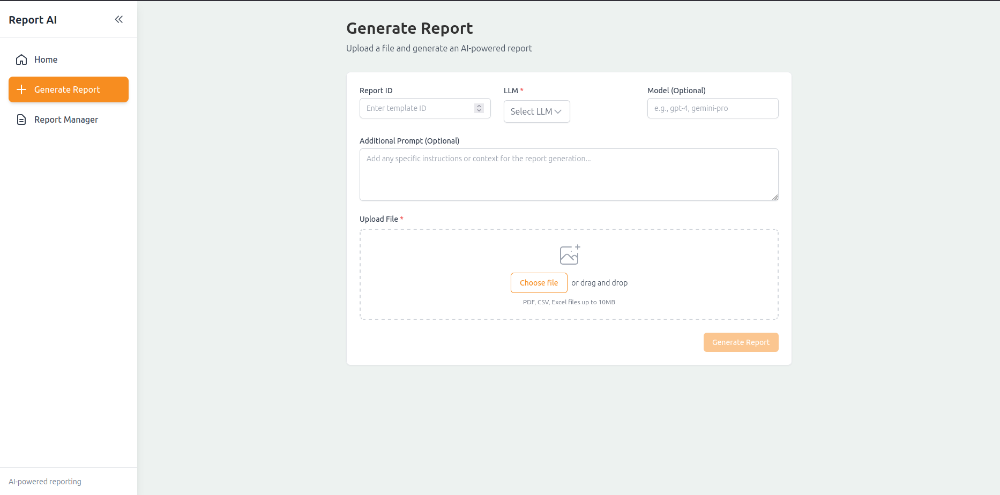

# ReportIA

## Introduction

ReportIA is a full-stack application designed to generate, manage, and serve AI-powered reports. The project is split into two main parts: a Go-based backend API and a React (TypeScript) frontend. It leverages modern technologies and best practices for scalability, maintainability, and developer experience.


---

## Backend

**Technologies:**
- Go (Golang)
- net/http, gorilla/mux (routing)
- encoding/json (serialization)
- PostgreSQL (database)
- Docker Compose (for local DB)
- Project structure follows best practices: config, handler, service, repository, model, middleware, etc.

**How to Run the Backend:**
1. **Install Go** (if not already): https://go.dev/doc/install
2. **Install Docker & Docker Compose** (for PostgreSQL): https://docs.docker.com/get-docker/
3. **Clone the repository** and navigate to the `backend` folder.
4. **Start the database**:
	```bash
	docker-compose up -d db
	```
	This will start a PostgreSQL instance with migrations applied.
5. **Configure environment variables:**
	- Copy `.env` or `.env.local` and adjust as needed.
6. **Install Go dependencies:**
	```bash
	cd backend/api
	go mod tidy
	```
7. **Run the backend server:**
	```bash
	go run main.go
	```
	The API will be available at `http://localhost:8080` (default).

---

## Frontend

**Technologies:**
- React 18+ (TypeScript)
- Vite (build tool)
- Tailwind CSS (styling)
- React Router (routing)
- Axios (API calls)
- Context API (state management)

**How to Run the Frontend:**
1. **Install Node.js & npm**: https://nodejs.org/
2. **Navigate to the frontend folder:**
	```bash
	cd frontend
	```
3. **Install dependencies:**
	```bash
	npm install
	```
4. **Start the development server:**
	```bash
	npm run dev
	```
	The app will be available at `http://localhost:5173` (default).

---

## Project Structure

- `backend/` — Go API, business logic, DB migrations
- `frontend/` — React app, UI, assets
- `docker-compose.yml` — Local development DB
- `assets/` — Example files, templates, outputs

---

## License

MIT
